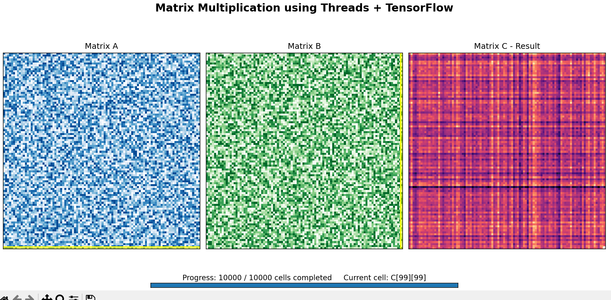

# OS.TASK
# OS.TASK

## 🧵 Multithreading Assignment

This project demonstrates multithreading through two different problems using Java and Python.

The two problems implemented in this assignment are:

1. **Producer-Consumer Problem using Java Threads**
2. **Matrix Multiplication using Python Threads + TensorFlow with Animation**

The main aim of this assignment is to understand how threads work, how multiple threads can perform different tasks concurrently, and how shared data can be handled safely.

The matrix multiplication part also includes a visual animation to make the working of the program easier to understand.

---

# 📂 Project Files

| File | Description |
|------|-------------|
| `ProducerConsumer.java` | Java implementation of the Producer-Consumer problem |
| `MatrixMultiplication.py` | Python implementation of 100 × 100 matrix multiplication |
| `matrixmultiplication.mp4` | Animation video of the matrix multiplication |
| `matrix_result.png` | Screenshot of the final animation result |
| `README.md` | Project documentation |

---

# 1. Producer-Consumer Problem

## 📖 Description

The Producer-Consumer problem is implemented using Java threads.

In this program, the Producer creates values and puts them into a shared buffer. The Consumer removes those values from the same buffer.

Since both threads access the same buffer, synchronization is needed to make sure that the buffer is accessed correctly.

A fixed-size circular buffer is used for storing the values.

---

## ⚙️ Working

The shared buffer keeps track of three main things:

- `in` - position where the next value is added
- `out` - position where the next value is removed
- `count` - number of values currently present in the buffer

The buffer is circular, so after reaching the last position it starts again from the first position.

This is done using the modulo operation:

```java
in = (in + 1) % size;
out = (out + 1) % size;
```

This allows the same buffer space to be reused.

---

## 🔐 Synchronization

Both Producer and Consumer access the same buffer, so synchronization is used.

The `produce()` and `consume()` methods are synchronized.

If the buffer is full, the Producer waits using:

```java
wait();
```

Similarly, if the buffer is empty, the Consumer waits until a new value is produced.

After producing or consuming an item, `notifyAll()` is used:

```java
notifyAll();
```

This allows the waiting thread to continue its execution.

---

## 🧵 Producer

The Producer thread generates values and adds them to the shared buffer.

If the buffer is full, the Producer waits until the Consumer removes an item.

The Producer continues this process until all required values have been produced.

---

## 🧵 Consumer

The Consumer thread removes values from the shared buffer.

If the buffer is empty, the Consumer waits for the Producer to add a value.

The Consumer continues until all the required values have been consumed.

---

## 🔹 Concepts Used

- Java Multithreading
- Producer-Consumer Problem
- Shared Resources
- Synchronization
- `synchronized`
- `wait()`
- `notifyAll()`
- Circular Buffer
- Thread Communication

---

# 2. Matrix Multiplication using Threads + TensorFlow

## 📖 Description

The second part of the assignment performs multiplication of two **100 × 100 matrices** using Python threads and TensorFlow.

The basic operation is:

```text
Matrix A (100 × 100) × Matrix B (100 × 100)
                    ↓
             Matrix C (100 × 100)
```

Matrix C contains the final result of the multiplication.

Since a 100 × 100 matrix contains 10,000 cells, the program calculates each result cell separately using a thread.

---

## ⚙️ Creating the Matrices

The program creates two random matrices using TensorFlow.

The size is defined as:

```python
SIZE = 100
```

Matrix A is created using:

```python
A = tf.random.uniform(
    (SIZE, SIZE),
    minval=1,
    maxval=10,
    dtype=tf.int32
)
```

Matrix B is created in the same way.

An empty NumPy matrix is then created for storing the result:

```python
C = np.zeros((SIZE, SIZE), dtype=int)
```

---

## 🧵 Using Threads

A separate thread is created for every cell of Matrix C.

The thread is created using:

```python
t = threading.Thread(
    target=calculate_cell,
    args=(i, j)
)
```

The row and column values are passed to the function so that each thread knows which cell it has to calculate.

For example:

```text
C[0][0]
C[0][1]
C[0][2]
...
C[99][99]
```

The program creates threads for all the required cells.

---

## 🔢 Calculating a Cell

The `calculate_cell()` function takes one row from Matrix A and one column from Matrix B.

```python
row_data = A[row, :]
column_data = B[:, col]
```

TensorFlow is then used to calculate the dot product:

```python
value = tf.reduce_sum(row_data * column_data)
```

The result is stored in Matrix C:

```python
C[row][col] = int(value.numpy())
```

Therefore, every position in Matrix C gets its value from the corresponding row of A and column of B.

---

## ⏳ Waiting for Threads

After all the threads are started, the program waits for them to complete.

```python
for t in threads:
    t.join()
```

The `join()` method makes sure that the complete matrix calculation is finished before the animation starts.

---

# 🔐 Thread Synchronization

The program maintains a list called `completed`.

This list stores the positions of cells after their calculations are completed.

Since multiple threads can access this list, a lock is used:

```python
lock = threading.Lock()
```

The completed cell is added using:

```python
with lock:
    completed.append((row, col))
```

The lock helps prevent multiple threads from updating the shared list at the same time.

---

# 🎬 Matrix Multiplication Animation

After the matrix calculations are completed, Matplotlib is used to display the result through an animation.

The animation contains three panels.

### 🔵 Matrix A

Matrix A is displayed on the left side.

A horizontal marker shows the row currently associated with the calculation.

### 🟢 Matrix B

Matrix B is displayed in the middle.

A vertical marker shows the column currently associated with the calculation.

### 🟠 Matrix C

Matrix C is displayed on the right side.

It starts empty and gradually gets filled with the calculated values.

A marker shows the current cell of Matrix C.

---

## 📊 Animation Progress

The animation also shows the number of completed cells.

For example:

```text
Progress: 5000 / 10000 cells completed
Current cell: C[45][78]
```

The program displays multiple cells in each animation frame instead of showing only one cell at a time.

This is controlled using:

```python
CELLS_PER_FRAME = 100
```

This makes the animation faster while still showing the progress of the matrix calculation.

---

# 🖼️ Animation Result

The following screenshot shows the final stage of the animation after all 10,000 cells have been completed.



At the end of the animation, the progress display shows:

```text
Progress: 10000 / 10000 cells completed
Current cell: C[99][99]
```

The values in Matrix A and Matrix B are generated randomly, so the matrices can look different every time the program is executed.

---

# 🎥 Animation Video

A complete animation video is also included in the repository.

The file is:

```text
matrixmultiplication.mp4
```

The animation shows Matrix A, Matrix B and Matrix C together while the result matrix is being filled.

---

# 🛠️ Technologies Used

| Technology | Purpose |
|------------|---------|
| ☕ Java | Producer-Consumer implementation |
| 🐍 Python | Matrix multiplication |
| 🧵 Java Threads | Producer and Consumer execution |
| 🧵 Python Threads | Matrix cell calculations |
| 🔐 Synchronization | Safe access to shared data |
| 🤖 TensorFlow | Matrix calculations |
| 🔢 NumPy | Result matrix storage |
| 📊 Matplotlib | Animation and visualization |

---

# 📋 Requirements

## Java

- JDK 8 or above
- Eclipse or any Java IDE

## Python

- Python 3.9 or above
- TensorFlow
- NumPy
- Matplotlib

---

# 📦 Installation

Install the required Python packages using:

```bash
pip install tensorflow numpy matplotlib
```

---

# ▶️ Running the Java Program

Open the project in Eclipse.

1. Create a Java project.
2. Add `ProducerConsumer.java`.
3. Add the required Java classes.
4. Run `ProducerConsumer.java` as a Java Application.
5. The Producer and Consumer threads will start executing.

---

## 🖥️ Sample Java Output

```text
Produced: 1
Consumed: 1
Produced: 2
Produced: 3
Consumed: 2
Produced: 4
Consumed: 3
Produced: 5
Consumed: 4
...
```

The exact order of the output can change between executions because the Producer and Consumer are separate threads.

---

# ▶️ Running the Python Program

Open the project folder in VS Code.

Install the required packages:

```bash
pip install tensorflow numpy matplotlib
```

Run the program using:

```bash
python MatrixMultiplication.py
```

The program will:

1. Create two 100 × 100 matrices.
2. Create threads for the matrix calculations.
3. Calculate the result using TensorFlow.
4. Wait for all threads to finish.
5. Display a small part of Matrix C in the terminal.
6. Open the matrix animation.
7. Show the progress of the calculation.

---

## 🖥️ Sample Python Output

```text
Starting matrix multiplication...

Matrix multiplication completed.
Time taken: X.XXX seconds

First 3 x 3 values of Matrix C:
[...., ...., ....]
[...., ...., ....]
[...., ...., ....]
```

The values can change every time because the input matrices are generated randomly.

The execution time can also vary depending on the computer and how the threads are scheduled.

---

# 🎯 Learning Outcomes

Through this assignment, the following concepts were implemented:

- Creating and running threads
- Concurrent execution
- Producer-Consumer communication
- Shared resources
- Synchronization
- Circular buffers
- `wait()` and `notifyAll()`
- Python multithreading
- Matrix multiplication
- TensorFlow operations
- Thread synchronization using locks
- Using `join()` to wait for threads
- Matplotlib animation
- Data visualization

---

# 📌 Conclusion

This project demonstrates multithreading through two different problems.

The first part implements the Producer-Consumer problem using Java threads and a shared circular buffer. Synchronization, `wait()` and `notifyAll()` are used so that the Producer and Consumer can work together safely.

The second part performs multiplication of two 100 × 100 matrices using Python threads and TensorFlow. A separate thread is used to calculate each cell of the result matrix.

The animation provides a visual representation of the matrix multiplication by displaying Matrix A, Matrix B and Matrix C together. The row and column markers, current cell marker and progress counter make it easier to understand the calculation.

Overall, this assignment helped in understanding multithreading, synchronization, shared resources, concurrent execution, TensorFlow operations and visualization.
